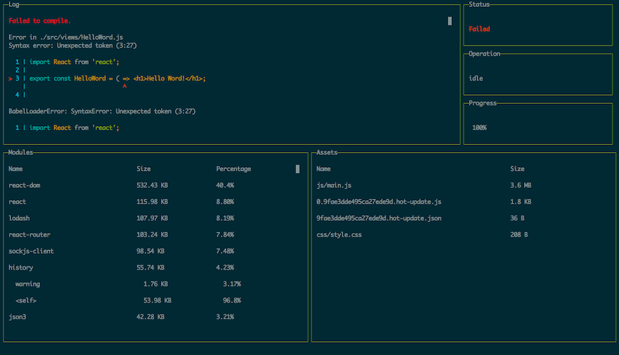

# Lyef Redux Boilerplate

> An opionated structure to create projects using React, Redux and Webpack.



## Getting Started

For now, you can clone this repo or use the [slush generator](https://github.com/lyef/slush-lyef-react). We are creating a [CLI](https://github.com/lyef/lyef-react-cli) also.

**You’ll need to have Node >= 4 on your machine.** We recommend to use Node >= 6 and npm >= 3 for faster installation speed and better disk usage.

## Folders and Files

```sh
├── images
├── src
│   ├── actions
│   ├── components
│   ├── containers
│   ├── reducers
│   ├── services
│   ├── styles
│   │   ├── base
│   │   ├── compoents
│   │   ├── generic
│   │   ├── objects
│   │   ├── settings
│   │   ├── tools
│   │   ├── trumps
│   │   └── style.styl
│   ├── views
│   ├── app.js
│   ├── configureStore.js
│   ├── constants.js
│   ├── history.js
│   ├── root.js
│   └── routes.js
├── tests
│   ├── specs
│   │   └── views
│   ├── utils
│   │   └── helper.js
│   └── setup.js
├── webpack
│   ├── base.js
│   ├── dev.js
│   └── prod.js
├── .babelrc
├── .editorconfig
├── .eslintrc
├── .gitignore
├── .npmrc
├── CONTRIBUTING.md
├── LICENSE.md
├── README.md
├── index.html
└── package.json
```

## Commands

* **npm start**: start a server on [http://localhost:8000](http://localhost:8000).
* **npm test**: run your tests in a single-run mode.
* **npm run test:tdd**: run and keep watching your test files.
* **npm run lint**: lint all files searching for errors.
* **npm run lint:fix**: fix automaticaly some lint errors.
* **npm run ci**: run tests and lint.
* **npm build**: build the project at `dist`.

## Stack

- [React](https://facebook.github.io/react/)
- [React Router](https://github.com/ReactTraining/react-router)
- [Redux](http://redux.js.org/docs/introduction/)
- [Babel 6](https://babeljs.io/) - Javascript Compiler.
- [Webpack](https://webpack.github.io/) - Javascript module bundler.
- [Webpack Dashboard](https://github.com/FormidableLabs/webpack-dashboard)
- [Eslint](http://eslint.org/) - The pluggable linting utility for JavaScript and JSX.
- [Husky](https://github.com/typicode/husky) - Git hooks made easy.
- [Mocha](https://mochajs.org/) - JavaScript test framework.
- [Chai](http://chaijs.com/) - BDD / TDD assertion library.
- [Sinon](http://sinonjs.org/) - Standalone test spies, stubs and mocks for JavaScript.
- [Nyc](https://github.com/istanbuljs/nyc) - Istanbul command line interface.
- [Enzyme](http://airbnb.io/enzyme/) - JavaScript Testing utility for React.
- [JSDOM](https://github.com/tmpvar/jsdom) - A JavaScript implementation of the WHATWG DOM and HTML standards.
- [Stylus](http://stylus-lang.com/) - Preprocessor CSS
- [PostCSS](http://postcss.org/) - A tool for transforming CSS with JavaScript

As you can see, we use a lot of great tools and if you want to see more, take a look at our [package.json](package.json).

## Code Standarts

This project uses [eslint](http://eslint.org/) and [.editorconfig](http://editorconfig.org/) is defined to have indent_size of **4 spaces**. You can change that on [.eslintrc](https://github.com/lyef/lyef-redux-boilerplate/blob/master/.eslintrc#L16) file.

This project also uses [Husky](https://github.com/typicode/husky) to prevent to push code with lint errors or broken tests. If you don't want this, you can uninstall running `npm uninstall --save-dev husky` and deleting the [prepush command](https://github.com/lyef/lyef-redux-boilerplate/blob/master/package.json#L21) on `package.json`.

## Contributing

We'd love to have your helping hand on our lyef-redux-boilerplate! See [CONTRIBUTING.md](https://github.com/lyef/lyef-redux-boilerplate/blob/master/CONTRIBUTING.md) for more information on what we're looking for and how to get started.

## License

[MIT License](https://github.com/lyef/lyef-redux-boilerplate/blob/master/LICENSE.md) @ [lyef](https://lyef.github.io)
